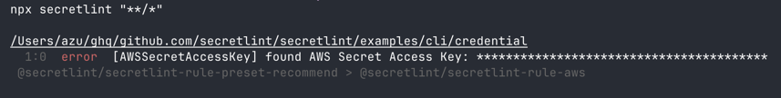
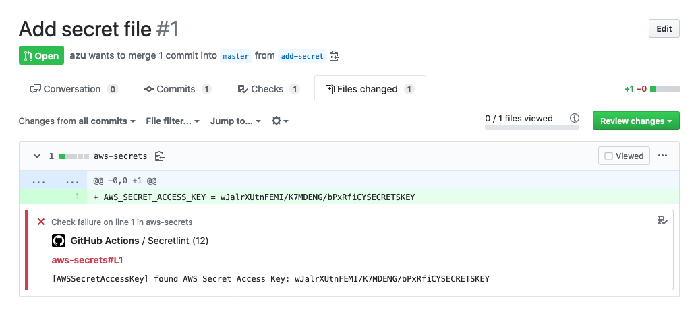
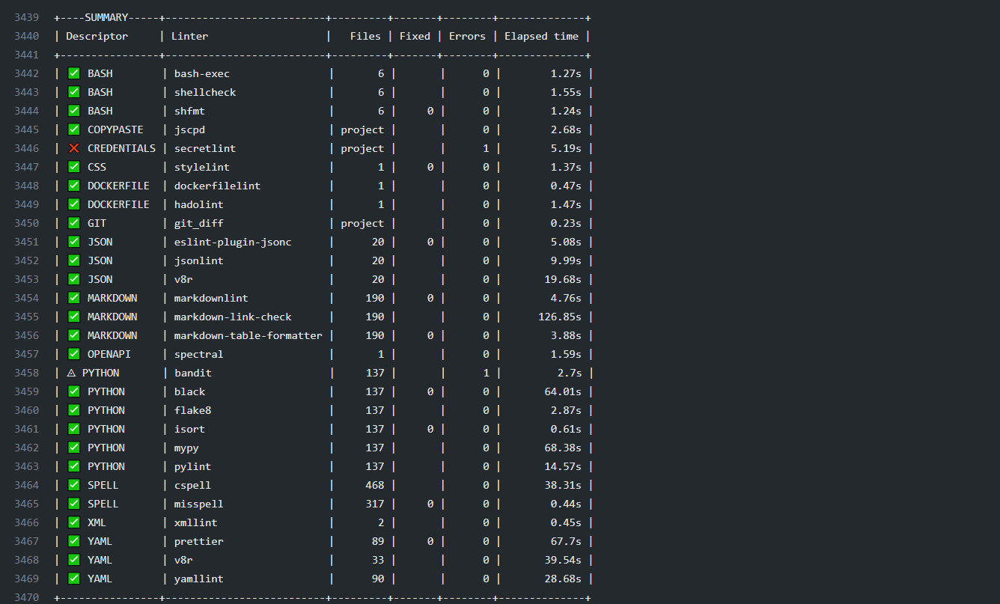
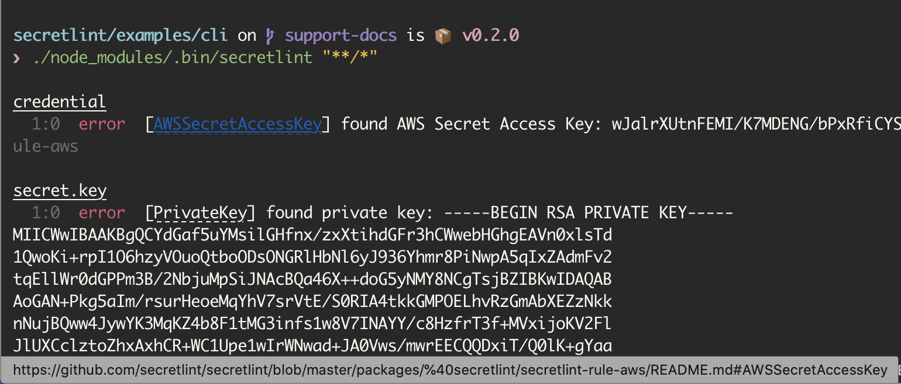

# Secretlint 

[](https://npmjs.org/package/secretlint)
[](https://npmjs.org/package/secretlint)
[](https://github.com/secretlint/secretlint/stargazers/)<!-- gh-dependents-info-used-by-start -->
[](https://github.com/secretlint/secretlint/blob/main/docs/github-dependents-info.md)<!-- gh-dependents-info-used-by-end -->
[](https://github.com/secretlint/secretlint/actions?query=workflow%3A"test")


> Secretlint is that Pluggable linting tool to prevent committing credential.

## Features

- **Scanner**: Found credentials in a project and report these
- **Project** Friendly: Easy to set up your project and integrate CI services
- **Pre-Commit Hook**: Prevent committing credential files
- **Pluggable**: Allow creating custom rule and flexible configuration
- **Documentation**: Describe the reason that rule detect it as secret

## Quick Demo

You can view secretlint linting result on <https://secretlint.github.io/>.

## Quick Start

You can try to use Secretlint on your project at one command.

If you already have installed Docker:

    docker run -v `pwd`:`pwd` -w `pwd` --rm -it secretlint/secretlint secretlint "**/*"

If you already have installed Node.js:

    npx @secretlint/quick-start "**/*"

After running, 
If you got empty result and exit status is `0`, your project is secure.
Otherwise, you got some error report, your project includes credential as raw data.



You want to get continuous security, Please see following installation guide and setup pre-commit hook and CI.

## Installation

### Using Docker

**Prerequisites:** Require [Docker](https://docs.docker.com/install/)

Use our [Docker container](https://hub.docker.com/r/secretlint/secretlint) to get an environment with Node.js and secretlint and running as fast as you can download them.

You can check all files under the current directory with secretlint by following command: 

    docker run -v `pwd`:`pwd` -w `pwd` --rm -it secretlint/secretlint secretlint "**/*"

[`secretlint/secretlint` docker container](https://hub.docker.com/r/secretlint/secretlint) work without configuration by design.

This Docker Image has built-in packages:

- [@secretlint/secretlint-rule-preset-recommend](https://www.npmjs.com/package/@secretlint/secretlint-rule-preset-recommend) 
- [@secretlint/secretlint-rule-pattern](https://www.npmjs.com/package/@secretlint/secretlint-rule-pattern)
- [@secretlint/secretlint-formatter-sarif](https://www.npmjs.com/package/@secretlint/secretlint-formatter-sarif)

For more details, please see [secretlint's Dockerfile](./publish/docker).

### Using Node.js

**Prerequisites:**  Require [Node.js 18+](https://nodejs.org/).

Secretlint is written by JavaScript.
You can install Secretlint using [npm](https://www.npmjs.com/):

```
npm install secretlint @secretlint/secretlint-rule-preset-recommend --save-dev
```

You should then set up a configuration file:

```
npx secretlint --init
```

Finally, you can run Secretlint on any file or directory like this:

```
npx secretlint "**/*"
```

:memo: Secretlint support [glob pattern](https://github.com/mrmlnc/fast-glob#basic-syntax) and glob pattern should be wrapped by a double quote.

It is also possible to install Secretlint globally using `npm install --global`. But, We do not recommended it, some rules may be broken in globally.

## Usage

`secretlint --help` show Usage.

      Secretlint CLI that scan secret/credential data.
    
      Usage
        $ secretlint [file|glob*]
    
      Note
        supported glob syntax is based on microglob
        https://github.com/micromatch/micromatch#matching-features
    
      Options
        --init             setup config file. Create .secretlintrc.json file from your package.json
        --format           [String] formatter name. Default: "stylish". Available Formatter: checkstyle, compact, jslint-xml, json, junit, pretty-error, stylish, table, tap, unix, mask-result
        --output           [path:String] output file path that is written of reported result.
        --no-color         disable ANSI-color of output.
        --no-terminalLink  disable terminalLink of output.
        --maskSecrets      enable masking of secret values. replace actual secrets with "***".
        --secretlintrc     [path:String] path to .secretlintrc config file. Default: .secretlintrc.*
        --secretlintignore [path:String] path to .secretlintignore file. Default: .secretlintignore
    
      Options for Developer
        --profile          Enable performance profile.
        --secretlintrcJSON [String] a JSON string of .secretlintrc. use JSON string instead of rc file.
    
      Experimental Options
        --locale            [String] locale tag for translating message. Default: en
    
      Examples
        $ secretlint ./README.md
        # glob pattern should be wrapped with double quote
        $ secretlint "**/*"
        $ secretlint "source/**/*.ini"
        # found secrets and mask the secrets
        $ secretlint .zsh_history --format=mask-result --output=.zsh_history

    Exit Status
      Secretlint exits with the following values:
    
      - 0: 
        - Linting succeeded, no errors found. 
        - Found lint error but --output is specified.
      - 1: 
        - Linting failed, errors found.
      - 2: 
        - Unexpected error occurred, fatal error.

## Configuration

Secretlint has a configuration file `.secretlintrc.{json,yml,js}`.

- Document: [Configuring Secretlint](./docs/configuration.md)

After running `secretlint --init`, you'll have a `.secretlintrc.json` file in your directory.

In it, you'll see some rules configured like this:

```json
{
  "rules": [
    {
      "id": "@secretlint/secretlint-rule-preset-recommend"
    }
  ]
}
```

The `id` property is the name of secretlint rule package. 

Secretlint does not have built-in rule.
You want to add some rule and You should **install** the package and **add** the rule to `.secretlintrc` file.

Each rule has same configuration pattern:

- `options`: Option definition for the rule. For more details, see each rule documentation
- `disabled`: If `disabled` is `true`, disable the rule
- `allowMessageIds`: `allowMessageIds` is an array of message id that you want to suppress error report
    - message id is defined in each rule and please see the rule documentation

### Example: `options`

For example, `@secretlint/secretlint-rule-example` has `allows` in `options`.
This `allows` option define a list of [RegExp-like String](https://github.com/textlint/regexp-string-matcher#regexp-like-string) that you want to ignore.

```json
{
  "rules": [
    {
      "id": "@secretlint/secretlint-rule-example",
      "options": {
        "allows": [
          "/dummy_secret/i"
        ]
      }
    }
  ]
}
```

When you use a preset like `@secretlint/secretlint-rule-preset-recommend`, you need to put the option in `rules`.

For example, an option for `@secretlint/secretlint-rule-preset-recommend > @secretlint/secretlint-rule-aws` 

```json5
{
  "rules": [
    {
      "id": "@secretlint/secretlint-rule-preset-recommend",
      "rules": [
        {
          "id": "@secretlint/secretlint-rule-aws",
            "options": {
              "allows": [
	            // it will be ignored
                "xxxx-xxxx-xxxx-xxxx-xxxx"
              ]
            }
        }
      ]
    }
  ]
}
```

### Example: `allowMessageIds`

For example, you have got following error report by run `secretlint`:

```
$ secretlint "**/*"

SECRET.txt
  1:8  error  [EXAMPLE_MESSAGE] found secret: SECRET  @secretlint/secretlint-rule-example

✖ 1 problem (1 error, 0 warnings)
```

This error's message id is `EXAMPLE_MESSAGE` in `@secretlint/secretlint-rule-example`.

If you want to ignore this error, please use `allowMessageIds`.

```json
{
  "rules": [
    {
      "id": "@secretlint/secretlint-rule-example",
      "allowMessageIds": ["EXAMPLE_MESSAGE"]
    }
  ]
}
```

When you use a preset like `@secretlint/secretlint-rule-preset-recommend`, you need to put the option in `rules`.

For example, If you want to ignore "AWSAccountID" and "AWSAccessKeyID" of "@secretlint/secretlint-rule-aws", you can write following.

```json5
{
  "rules": [
    {
      "id": "@secretlint/secretlint-rule-preset-recommend",
      "rules": [
        {
          "id": "@secretlint/secretlint-rule-aws",
          "allowMessageIds": ["AWSAccountID", "AWSAccessKeyID"]
        }
      ]
    }
  ]
}
```

### Ignoring by comment

[@secretlint/secretlint-rule-filter-comments](https://www.npmjs.com/package/@secretlint/secretlint-rule-filter-comments) supports ignoring comment like `secretlint-disable`.

```
// secretlint-disable

THIS IS SECRET, BUT IT WILL BE IGNORED

// secretlint-enable
```

For more details, please see [Configuring Secretlint](./docs/configuration.md).

## Use Cases

### Hide secrets in lint error message

Secretlint support `--maskSecrets` option that mask secrets in lint error message.
It is useful that you want to hide secrets in CI logs.

```bash
$ secretlint --maskSecrets "**/*"
```

### Fix secrets

Secretlint can not fix the secrets automatically.
However, It is useful that `--format=mask-result` mask the secrets of input file.

For example, you can mask the secrets of `.zsh_history` file and overwrite it.

```bash
$ secretlint .zsh_history --format=mask-result --output=.zsh_history
```

## Rule Packages

Secretlint rules has been implemented as separated modules.

- [@secretlint/secretlint-rule-npm](./packages/@secretlint/secretlint-rule-npm)
- [@secretlint/secretlint-rule-aws](./packages/@secretlint/secretlint-rule-aws)
- [@secretlint/secretlint-rule-gcp](./packages/@secretlint/secretlint-rule-gcp)
- [@secretlint/secretlint-rule-github](./packages/@secretlint/secretlint-rule-github)
- [@secretlint/secretlint-rule-privatekey](./packages/@secretlint/secretlint-rule-privatekey)
- [@secretlint/secretlint-rule-basicauth](./packages/@secretlint/secretlint-rule-basicauth)
- [@secretlint/secretlint-rule-slack](./packages/@secretlint/secretlint-rule-slack)
- [@secretlint/secretlint-rule-sendgrid](./packages/%40secretlint/secretlint-rule-sendgrid)
- [@secretlint/secretlint-rule-shopify](./packages/%40secretlint/secretlint-rule-shopify)
- [@secretlint/secretlint-rule-secp256k1-privatekey](./packages/@secretlint/secretlint-rule-secp256k1-privatekey)
- [@secretlint/secretlint-rule-no-k8s-kind-secret](./packages/@secretlint/secretlint-rule-no-k8s-kind-secret)
- [@secretlint/secretlint-rule-pattern](./packages/@secretlint/secretlint-rule-pattern)
- [@secretlint/secretlint-rule-no-homedir](./packages/@secretlint/secretlint-rule-no-homedir)
- [@secretlint/secretlint-rule-no-dotenv](./packages/%40secretlint/secretlint-rule-no-dotenv)

Also, Secretlint provide rule preset that includes recommened rule set.

- [@secretlint/secretlint-rule-preset-recommend](./packages/@secretlint/secretlint-rule-preset-recommend)
    - Recommended rule set

## Custom Rules

You can create own secretlint rule.

You want to get a secretlint rule for suitable your project and you can create it!
A secretlint rule is a just npm package.

If you want to know creating secretlint rule, please see [docs/secretlint-rule.md](docs/secretlint-rule.md).

## Integrations

### Pre-commit Hook per project

You can use Secretlint with some pre-commit tool.
This can prevent to commit secret data by linting with Secretlint.

Applying secretlint to the project and improve security on team developing.

#### [Husky](https://github.com/typicode/husky) + [lint-staged](https://github.com/okonet/lint-staged)

**Use Case:** If you want to introduce secretlint to Node.js project, this combination is useful.

Install [Husky](https://github.com/typicode/husky) and [lint-staged](https://github.com/okonet/lint-staged):

```
npx husky-init && npm install lint-staged --save-dev
```

Add hooks to `.husky/pre-commit`:

```
npx husky add .husky/pre-commit "npx --no-install lint-staged"
```

Edit `package.json`:

```json5
{
  // add "lint-staged" field
  "lint-staged": {
    "*": [
      "secretlint"
    ]
  }
}
```

This means that check each staged file by Secretlint before commit. 

#### [pre-commit](https://github.com/pre-commit/pre-commit)

**Use Case:** You have a project that is developing with Docker. Easy to integrate to secretlint.

Install [pre-commit](https://pre-commit.com/#install)

    # macOS. see also https://pre-commit.com/#install
    brew install pre-commit

Create `.pre-commit-config.yaml`:

```
-   repo: local
    hooks:
    -   id: secretlint
        name: secretlint
        language: docker_image
        entry: secretlint/secretlint:latest secretlint
```

Example setup repository:

- https://github.com/azu/secretlint-pre-commit-example

#### Bash Script

Alternately you can save this script as `.git/hooks/pre-commit` and give it execute permission(`chmod +x .git/hooks/pre-commit`):

```bash
#!/bin/sh
FILES=$(git diff --cached --name-only --diff-filter=ACMR | sed 's| |\\ |g')
[ -z "$FILES" ] && exit 0

# Secretlint all selected files
echo "$FILES" | xargs ./node_modules/.bin/secretlint
# If you using docker
# echo "$FILES" | xargs docker run -v `pwd`:`pwd` -w `pwd` --rm secretlint/secretlint secretlint
RET=$?
if [ $RET -eq 0 ] ;then
    exit 0
else
    exit 1
fi
```

### Pre-commit Hook globally

**Use Case:** If you want to check any project by secretlint, you can use global git hooks.

[Git 2.9+](https://github.blog/2016-06-13-git-2-9-has-been-released/) supports [`core.hooksPath`](https://git-scm.com/docs/githooks).
It allow to integrate secretlint globally.

We have created example git hooks project using secretlint + Docker.

- [secretlint/git-hooks](https://github.com/secretlint/git-hooks)
    - Requirement: Docker

You can set up by following steps:

```shell script
# clone this repository
git clone https://github.com/secretlint/git-hooks git-hooks
cd git-hooks
# integrate secretlint to git hook globally
git config --global core.hooksPath $(pwd)/hooks
```

After setup of `core.hooksPath`, secretlint check any file before you commit it.  

For more details, see [secretlint/git-hooks](https://github.com/secretlint/git-hooks) project.

Node.js version also can be used for global git hook.
If you interesting in it, please see [@azu/git-hooks](https://github.com/azu/git-hooks).

### CI

#### GitHub Actions

If you already set secretlint [Using Node.js](#using-nodejs), you can run secretlint with your configuration on [GitHub Actions](https://github.co.jp/features/actions).

Put `.github/workflows/secretlint.yml` in your repository.

```yaml
name: Secretlint
on: [push, pull_request]
permissions:
  contents: read
jobs:
  test:
    name: "Secretlint"
    runs-on: ubuntu-latest
    steps:
      - name: checkout
        uses: actions/checkout@v3
      - name: setup Node.js
        uses: actions/setup-node@v3
        with:
          node-version: 18
      - name: Install
        run: npm install
      - name: Lint with Secretlint
        run: npx secretlint "**/*"
```

This configuration also integrate Pull Request review comment via [actions/setup-node](https://github.com/actions/setup-node).



- Example Repository: https://github.com/secretlint/secretlint-github-actions-example
- Example Pull Request: https://github.com/secretlint/secretlint-github-actions-example/pull/1/files

#### Mega-Linter

[Mega-Linter](https://nvuillam.github.io/mega-linter/) is a linters aggregator natively compliant with any CI tool, embedding [80+ linting apps](https://nvuillam.github.io/mega-linter/supported-linters/), including [**secretlint**](https://nvuillam.github.io/mega-linter/descriptors/credentials_secretlint/) by default.

You can [install](https://nvuillam.github.io/mega-linter/installation/) it on any repository project using the following command (Node.js must be installed previously)

```shell
npx mega-linter-runner --install
```



### Browser

[Secretlint WebExtension](https://github.com/secretlint/webextension) works on your browser.

- Firefox: <https://addons.mozilla.org/ja/firefox/addon/secretlint/>
- Chrome: <https://chrome.google.com/webstore/detail/secretlint/hidpojbnemkajlnibhmeilpgoddkjjkf>

This web extension aim to founds credentials that are included in your request/response.


Secretlint WebExtension integrate to DevTools in Chrome/Firefox.
This extension help web developer to notice exposed credential.

### Others

#### SARIF format support

Please use [@secretlint/secretlint-formatter-sarif](./packages/@secretlint/secretlint-formatter-sarif).

```
npm install @secretlint/secretlint-formatter-sarif --dev
secretlint --format @secretlint/secretlint-formatter-sarif "**/*"
```

## Semantic Versioning Policy

Secretlint project follow [Semantic Versioning](https://semver.org/ "Semantic Versioning")([secretlint-rule-preset-canary](packages/@secretlint/secretlint-rule-preset-canary) is exception).

- Patch release (intended to not break your lint build)
    - A bug fix to the CLI or core (including formatters).
    - Improvements to documentation.
    - Non-user-facing changes such as refactoring.
    - Re-releasing after a failed release (i.e., publishing a release that doesn't work for anyone).
- Minor release (might break your lint build)
    - A new option.
    - An existing rule is deprecated.
    - A new CLI capability is created.
    - New public API are added (new classes, new methods, new arguments to existing methods, etc.).
        - It might break TypeScript definitions
    - A new formatter is created.
- Major release (break your lint build)
    - A new option to an existing rule that results in secretlint reporting more errors by default.
    - An existing formatter is removed.
    - Add new default rule to rule preset.
    - Part of the public API is removed or changed in an incompatible way.

## Motivation

- [git-secrets](https://github.com/awslabs/git-secrets) is useful, but it is hard to setup per project.
	- It main use-case is globally installation
	- Secretlint want to install for a project and customize setting per project.
- [repo-security-scanner](https://github.com/UKHomeOffice/repo-security-scanner), [Gitleaks](https://github.com/zricethezav/gitleaks) and [truffleHog](https://github.com/dxa4481/truffleHog) is good scan tools
	- Secretlint need to flexible customize that include ignoring definitions, custom rules.
- [detect-secrets](https://github.com/Yelp/detect-secrets) is similar tools, but it adopts opt-out approach
    - Secretlint adopt opt-in approach  
    - We also need to custom rules by user
		- See [Bring-your own-plugins (BYOP), via --custom-plugins option by KevinHock · Pull Request #255 · Yelp/detect-secrets](https://github.com/Yelp/detect-secrets/pull/255)
- GitHub support [secret scanning](https://docs.github.com/en/code-security/secret-security/about-secret-scanning), but it only works after push to your repository
    - Secretlint work on your local machine, Secretlint can prevent to commit

## Philosophy

- Reduce false-positive of linting
- Integration to developing workflow
- Empower Users to Contribute

### Opt-in instead of Opt-out

Secretlint adopt opt-in approach.

In our experience, linting tools that report various errors by default is difficult to use.
Opt-in approach help to introduce Secretlint increasing.

It will help to reduce false-positive by configuration.

### Rule as Documentation

We think a rule as a documentation.
So, Each rule should have reasonable documentation.

We need to describe why this file is error.
A rule that has not documentation, It is just a opinionated.

Describe the reason of error and then it will lead to reduce false-positive error.

Also, Secretlint CLI support hyperlink in Terminal.
It means that you can jump to rule documentation from lint error message directly.



> Example on iTerm 2: Cmd + Click error's messageId and open [AWSSecretAccessKey](https://github.com/secretlint/secretlint/blob/master/packages/%40secretlint/secretlint-rule-aws/README.md#awssecretaccesskey) on your browser. 

If you want to know support terminal, please see [Hyperlinks in Terminal Emulators](https://gist.github.com/egmontkob/eb114294efbcd5adb1944c9f3cb5feda). 

Also, Welcome to Contribution about secretlint documentation!

### Why Node.js?

- Package Manager
	- Require package manager to realize flexible pluggable system
	- Node.js has npm and yarn as package manager
	- Package manager help to install custom plugin/rule by user
- Exist Reference Implementation
	- Node.js already has pluggable linting tools like ESLint, textlint, stylelint etc
	- So Node.js user familiar with pluggable linting tools
	- Previously, I created textlint as same approach, so I familiar with Node.js
- Users
    - JavaScript is Popular language
    - It means that empower Users to Contribute
    - Users can create own rule by own hand

Of course, secretlint also support [Docker](https://hub.docker.com/r/secretlint/secretlint).

## Changelog

See [Releases page](https://github.com/secretlint/secretlint/releases).

## Contributing

Pull requests and stars are always welcome.

For bugs and feature requests, [please create an issue](https://github.com/secretlint/secretlint/issues).

See also, [CONTRIBUTING.md](./CONTRIBUTING.md) and [CODE_OF_CONDUCT.md](./CODE_OF_CONDUCT.md)

### Add New Rule

You can use `npm run gen:rule` command to create new rule.

```shell script
npm run gen:rule
```

For more details, please see [CONTRIBUTING.md](./CONTRIBUTING.md)

### Benchmark

Benchmark workflow is run on every commit.

- Benchmark: https://secretlint.github.io/secretlint/dev/bench/

## Author

- [github/azu](https://github.com/azu)
- [twitter/azu_re](https://twitter.com/azu_re)

## License

MIT © azu
